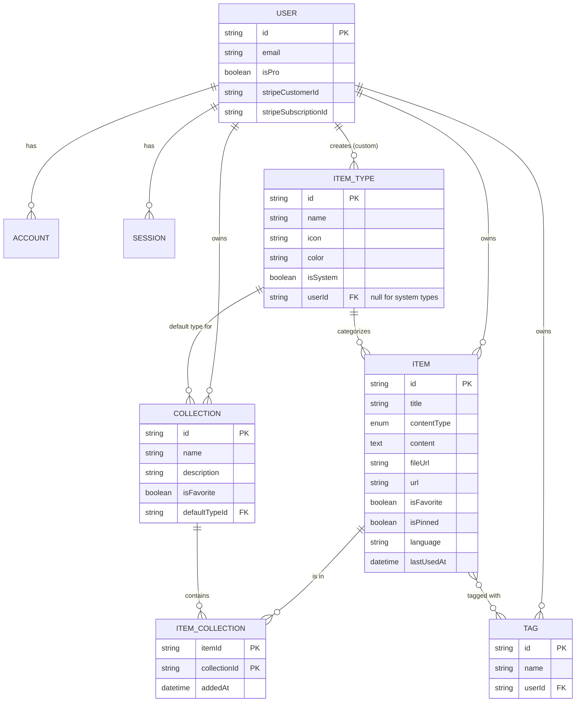
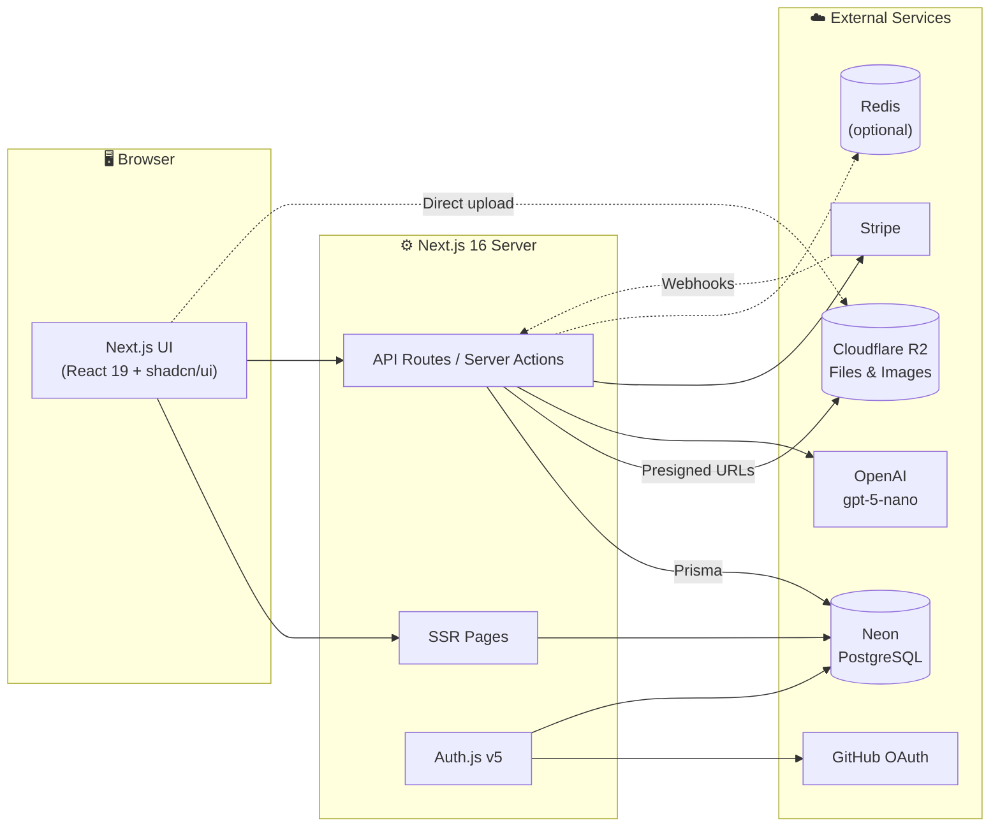
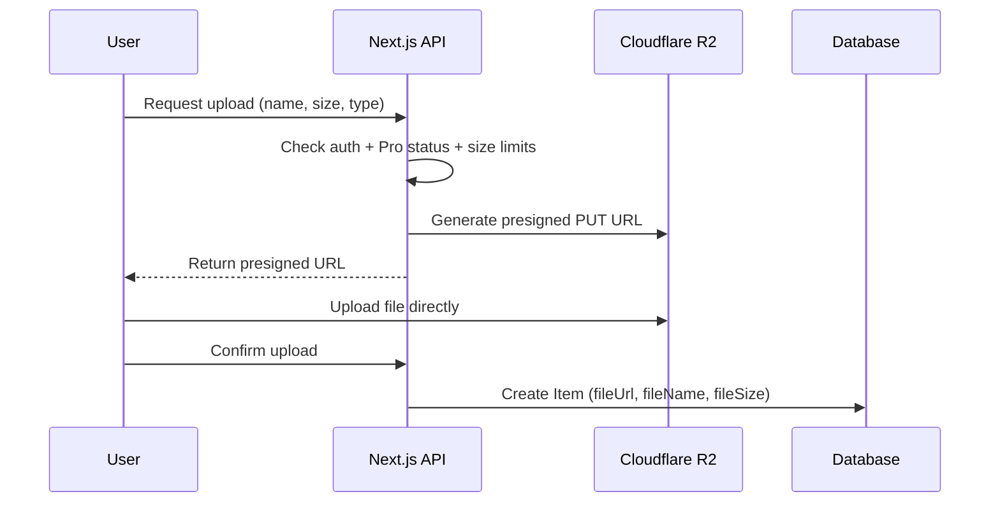

# 🗃️ DevStash — Project Overview

> **One fast, searchable, AI-enhanced hub for all your developer knowledge and resources.**

---

## Table of Contents

1. [Problem](#-problem)
2. [Target Users](#-target-users)
3. [Features](#-features)
4. [Data Model](#-data-model)
5. [Tech Stack](#-tech-stack)
6. [Architecture](#-architecture)
7. [Routes](#-routes)
8. [Monetization](#-monetization)
9. [UI / UX](#-ui--ux)
10. [Suggested Project Structure](#-suggested-project-structure)
11. [Development Rules](#-development-rules)
12. [Open Questions](#-open-questions)
13. [Reference Links](#-reference-links)

---

## 🧩 Problem

Developers keep their essentials scattered across many tools:

| Resource | Where it usually lives |
| --- | --- |
| Code snippets | VS Code, Notion |
| AI prompts | Old AI chat threads |
| Context files | Buried inside projects |
| Useful links | Browser bookmarks |
| Docs | Random folders |
| Commands | `.txt` files, bash history |
| Project templates | GitHub Gists |

This causes **context switching**, **lost knowledge**, and **inconsistent workflows**.

**DevStash** solves this with a single place to save, organize, search, and reuse all of it.

---

## 👥 Target Users

| Persona | Needs |
| --- | --- |
| 🧑‍💻 **Everyday Developer** | A fast way to grab snippets, prompts, commands, and links |
| 🤖 **AI-first Developer** | Saves prompts, context files, workflows, and system messages |
| 🎓 **Content Creator / Educator** | Stores code blocks, explanations, and course notes |
| 🏗️ **Full-stack Builder** | Collects patterns, boilerplates, and API examples |

---

## ✨ Features

### A. Items & Item Types

Every item has a **type**. DevStash ships with the following **system types**, which cannot be edited or deleted. Users will be able to create **custom types** later (Pro).

| Type | Content kind | Plan | Route |
| --- | --- | --- | --- |
| Snippet | Text | Free | `/items/snippets` |
| Prompt | Text | Free | `/items/prompts` |
| Note | Text | Free | `/items/notes` |
| Command | Text | Free | `/items/commands` |
| Link | URL | Free | `/items/links` |
| File | File | **Pro** | `/items/files` |
| Image | File | **Pro** | `/items/images` |

- Items open and are created inside a **quick-access drawer**, not a separate page.
- Text types use a **Markdown editor** with syntax highlighting.
- File types support **upload** to Cloudflare R2.

### B. Collections

- Users create collections that can hold items of **any type**.
- An item can belong to **multiple collections** (many-to-many).
  - e.g. a React snippet in both *React Patterns* and *Interview Prep*.
- Users can see which collections an item belongs to, and add/remove it from several at once.

**Examples**

- ⚛️ React Patterns — snippets, notes
- 📁 Context Files — files
- 🐍 Python Snippets — snippets

### C. Search

Fast search across:

- Content
- Tags
- Titles
- Types

> Start with PostgreSQL full-text search (`tsvector`) or `ILIKE` on indexed columns. Upgrade later only if needed.

### D. Authentication

- Email / password (credentials)
- GitHub OAuth

### E. Other Features

- ⭐ Favorite items and collections
- 📌 Pin items to the top
- 🕒 Recently used items
- 📥 Import code from a file
- 📝 Markdown editor for text types
- ⬆️ File upload for file/image types
- 📤 Export data (JSON / ZIP)
- 🌙 Dark mode by default, light mode optional
- 🔗 Add/remove items to/from multiple collections
- 👀 View which collections an item belongs to

### F. AI Features (Pro)

| Feature | Description |
| --- | --- |
| 🏷️ Auto-tag suggestions | Suggest tags based on item content |
| 📄 AI summaries | Short summary of an item |
| 💡 Explain this code | Plain-language explanation of a snippet |
| ✨ Prompt optimizer | Rewrite and improve saved prompts |

---

## 🗄️ Data Model

> This is a working draft and may change during development.

### Entity Relationship Diagram



### Prisma Schema (draft)

> Prisma 7 notes: the `prisma-client` generator requires an explicit `output`, and the database URL is configured in `prisma.config.ts` with a driver adapter (e.g. `@prisma/adapter-neon`). Double-check against the latest Prisma 7 docs before implementing.

```prisma
// prisma/schema.prisma

generator client {
  provider = "prisma-client"
  output   = "../src/generated/prisma"
}

datasource db {
  provider = "postgresql"
}

// ─────────────────────────────────────────────
// Enums
// ─────────────────────────────────────────────

enum ContentType {
  TEXT // snippet, prompt, note, command
  FILE // file, image
  URL  // link
}

// ─────────────────────────────────────────────
// Auth (Auth.js / NextAuth v5 Prisma adapter)
// ─────────────────────────────────────────────

model User {
  id            String    @id @default(cuid())
  name          String?
  email         String    @unique
  emailVerified DateTime?
  image         String?
  password      String?   // hashed; null for OAuth-only users

  // Billing
  isPro                Boolean @default(false)
  stripeCustomerId     String? @unique
  stripeSubscriptionId String? @unique

  createdAt DateTime @default(now())
  updatedAt DateTime @updatedAt

  accounts    Account[]
  sessions    Session[]
  items       Item[]
  itemTypes   ItemType[]
  collections Collection[]
  tags        Tag[]
}

model Account {
  userId            String
  type              String
  provider          String
  providerAccountId String
  refresh_token     String? @db.Text
  access_token      String? @db.Text
  expires_at        Int?
  token_type        String?
  scope             String?
  id_token          String? @db.Text
  session_state     String?

  createdAt DateTime @default(now())
  updatedAt DateTime @updatedAt

  user User @relation(fields: [userId], references: [id], onDelete: Cascade)

  @@id([provider, providerAccountId])
}

model Session {
  sessionToken String   @unique
  userId       String
  expires      DateTime

  createdAt DateTime @default(now())
  updatedAt DateTime @updatedAt

  user User @relation(fields: [userId], references: [id], onDelete: Cascade)
}

model VerificationToken {
  identifier String
  token      String
  expires    DateTime

  @@id([identifier, token])
}

// ─────────────────────────────────────────────
// App models
// ─────────────────────────────────────────────

model Item {
  id          String      @id @default(cuid())
  title       String
  contentType ContentType

  content  String? @db.Text // text content; null for files/links
  fileUrl  String?          // R2 URL; null for text
  fileName String?          // original filename
  fileSize Int?             // bytes
  url      String?          // link types

  description String?
  language    String?  // optional, for code highlighting
  isFavorite  Boolean  @default(false)
  isPinned    Boolean  @default(false)
  lastUsedAt  DateTime? // powers "Recently used"

  createdAt DateTime @default(now())
  updatedAt DateTime @updatedAt

  userId     String
  user       User     @relation(fields: [userId], references: [id], onDelete: Cascade)
  itemTypeId String
  itemType   ItemType @relation(fields: [itemTypeId], references: [id])

  tags        Tag[]
  collections ItemCollection[]

  @@index([userId])
  @@index([userId, itemTypeId])
  @@index([userId, isPinned])
  @@index([userId, lastUsedAt])
}

model ItemType {
  id       String  @id @default(cuid())
  name     String
  icon     String  // Lucide icon name
  color    String  // hex
  isSystem Boolean @default(false)

  userId String? // null for system types
  user   User?   @relation(fields: [userId], references: [id], onDelete: Cascade)

  items              Item[]
  defaultCollections Collection[]

  @@unique([name, userId])
}

model Collection {
  id          String  @id @default(cuid())
  name        String
  description String?
  isFavorite  Boolean @default(false)

  // Used for styling empty collections
  defaultTypeId String?
  defaultType   ItemType? @relation(fields: [defaultTypeId], references: [id], onDelete: SetNull)

  createdAt DateTime @default(now())
  updatedAt DateTime @updatedAt

  userId String
  user   User   @relation(fields: [userId], references: [id], onDelete: Cascade)

  items ItemCollection[]

  @@index([userId])
}

model ItemCollection {
  itemId       String
  collectionId String
  addedAt      DateTime @default(now())

  item       Item       @relation(fields: [itemId], references: [id], onDelete: Cascade)
  collection Collection @relation(fields: [collectionId], references: [id], onDelete: Cascade)

  @@id([itemId, collectionId])
  @@index([collectionId])
}

model Tag {
  id   String @id @default(cuid())
  name String

  userId String
  user   User   @relation(fields: [userId], references: [id], onDelete: Cascade)

  items Item[]

  @@unique([name, userId])
}
```

### Schema Notes

- **`ContentType` gained a `URL` value.** The original notes listed `text | file`, but link items store a `url`, so a third value keeps validation clean.
- **Tags are scoped per user.** The original draft had no owner on `Tag`, which would leak tag names between users.
- **`lastUsedAt` was added** to support the "Recently used" feature.
- **System type uniqueness:** Postgres treats `NULL`s as distinct, so `@@unique([name, userId])` won't block duplicate system types. Enforce this in the seed script (upsert by name) or with a partial unique index in a migration.
- **Credentials + database sessions:** Auth.js requires the JWT session strategy when using the credentials provider. The `Session` model can stay for the adapter, but sessions will be JWT-based.

### Seed Data — System Types

```ts
// prisma/seed.ts
const systemTypes = [
  { name: "snippet", icon: "Code",       color: "#3b82f6" },
  { name: "prompt",  icon: "Sparkles",   color: "#8b5cf6" },
  { name: "command", icon: "Terminal",   color: "#f97316" },
  { name: "note",    icon: "StickyNote", color: "#fde047" },
  { name: "file",    icon: "File",       color: "#6b7280" },
  { name: "image",   icon: "Image",      color: "#ec4899" },
  { name: "link",    icon: "Link",       color: "#10b981" },
];
```

---

## 🛠️ Tech Stack

| Layer | Technology | Notes |
| --- | --- | --- |
| Framework | [Next.js 16](https://nextjs.org/docs) + [React 19](https://react.dev) | SSR pages with dynamic client components |
| Language | [TypeScript](https://www.typescriptlang.org/docs/) | End-to-end type safety |
| Backend | Next.js API routes / Server Actions | Items, uploads, AI calls |
| Database | [Neon](https://neon.tech/docs) (PostgreSQL) | Serverless Postgres |
| ORM | [Prisma 7](https://www.prisma.io/docs) | Migrations only, never `db push` |
| Caching | [Redis](https://redis.io/docs/) *(optional)* | Consider Upstash if added |
| File storage | [Cloudflare R2](https://developers.cloudflare.com/r2/) | S3-compatible; presigned uploads |
| Auth | [Auth.js / NextAuth v5](https://authjs.dev) | Credentials + GitHub OAuth |
| AI | [OpenAI](https://platform.openai.com/docs) `gpt-5-nano` | Pro-only features |
| Payments | [Stripe](https://docs.stripe.com) | Subscriptions + webhooks |
| Styling | [Tailwind CSS v4](https://tailwindcss.com/docs) | |
| Components | [shadcn/ui](https://ui.shadcn.com) | |
| Icons | [Lucide](https://lucide.dev/icons/) | Used by shadcn/ui |

**Principle:** one codebase, one repo, minimal overhead.

---

## 🏛️ Architecture



### File Upload Flow



---

## 🧭 Routes

| Route | Purpose |
| --- | --- |
| `/` | Marketing / landing page |
| `/sign-in`, `/sign-up` | Authentication |
| `/dashboard` | Collection grid + recent/pinned items |
| `/items/[type]` | All items of a type (e.g. `/items/snippets`) |
| `/collections` | All collections |
| `/collections/[id]` | Items in a collection |
| `/favorites` | Favorited items and collections |
| `/search?q=` | Search results |
| `/settings` | Profile, theme, export |
| `/settings/billing` | Plan & Stripe portal |
| `/api/items` | Item CRUD |
| `/api/collections` | Collection CRUD |
| `/api/upload` | Presigned R2 URLs |
| `/api/ai/*` | Tagging, summaries, explain, prompt optimizer |
| `/api/export` | JSON / ZIP export |
| `/api/webhooks/stripe` | Stripe subscription events |

> Items open in a drawer. Optionally support `?item=<id>` so a drawer state is shareable/bookmarkable.

---

## 💰 Monetization

Freemium model.

| Feature | Free | Pro |
| --- | :---: | :---: |
| Items | 50 | ♾️ Unlimited |
| Collections | 3 | ♾️ Unlimited |
| System types (except file/image) | ✅ | ✅ |
| File & image uploads | ❌ | ✅ |
| Custom types *(coming later)* | ❌ | ✅ |
| Search | Basic | ✅ |
| AI auto-tagging | ❌ | ✅ |
| AI summaries | ❌ | ✅ |
| AI code explanation | ❌ | ✅ |
| AI prompt optimizer | ❌ | ✅ |
| Export (JSON / ZIP) | ❌ | ✅ |
| Priority support | ❌ | ✅ |
| **Price** | **$0** | **$8/mo** or **$72/yr** (25% off) |

### Development Mode

> 🚧 Build the Pro foundation (`isPro`, Stripe IDs, limit checks), but **all users can access everything during development**.

Suggested approach — a single gate helper plus an env flag:

```ts
// src/lib/plan.ts
export const FREE_LIMITS = { items: 50, collections: 3 } as const;

export function hasProAccess(user: { isPro: boolean }) {
  if (process.env.UNLOCK_ALL_FEATURES === "true") return true;
  return user.isPro;
}
```

---

## 🎨 UI / UX

### Principles

- Modern, minimal, developer-focused
- Dark mode by default, light mode optional
- Clean typography and generous whitespace
- Subtle borders and shadows
- Syntax highlighting for code blocks
- Inspiration: [Notion](https://www.notion.so), [Linear](https://linear.app), [Raycast](https://www.raycast.com)

### Layout

```
┌──────────────────────────────────────────────────────────────┐
│  🔍 Search                                    + New   👤     │
├───────────────┬──────────────────────────────────────────────┤
│ ☰ Sidebar     │  Collections                                 │
│               │  ┌──────────┐ ┌──────────┐ ┌──────────┐      │
│ TYPES         │  │ React    │ │ Prompts  │ │ Context  │      │
│  </> Snippets │  │ Patterns │ │          │ │ Files    │      │
│  ✨ Prompts   │  │ (blue bg)│ │(purp bg) │ │(gray bg) │      │
│  >_ Commands  │  └──────────┘ └──────────┘ └──────────┘      │
│  🗒 Notes     │                                              │
│  📄 Files     │  Items                                       │
│  🖼 Images    │  ┌──────────┐ ┌──────────┐ ┌──────────┐      │
│  🔗 Links     │  │ useDebnc │ │ git undo │ │ SysPrompt│      │
│               │  │(blue brd)│ │(orng brd)│ │(purp brd)│      │
│ COLLECTIONS   │  └──────────┘ └──────────┘ └──────────┘      │
│  React Pat.   │                                              │
│  Python       │                          ┌─────────────────┐ │
│  + New        │                          │  Item Drawer ▶  │ │
└───────────────┴──────────────────────────┴─────────────────┘─┘
```

- **Sidebar** (collapsible): item types linking to `/items/[type]`, plus latest collections.
- **Main area:** grid of collection cards. Each card's **background color** reflects the item type it contains most.
- **Items** appear below as cards with a **border color** matching their type.
- **Item drawer:** individual items open in a fast slide-out drawer for viewing and editing.

### Type Colors & Icons

| Type | Color | Swatch | Lucide Icon |
| --- | --- | --- | --- |
| Snippet | `#3b82f6` |  Blue | [`Code`](https://lucide.dev/icons/code) |
| Prompt | `#8b5cf6` |  Purple | [`Sparkles`](https://lucide.dev/icons/sparkles) |
| Command | `#f97316` |  Orange | [`Terminal`](https://lucide.dev/icons/terminal) |
| Note | `#fde047` |  Yellow | [`StickyNote`](https://lucide.dev/icons/sticky-note) |
| File | `#6b7280` |  Gray | [`File`](https://lucide.dev/icons/file) |
| Image | `#ec4899` |  Pink | [`Image`](https://lucide.dev/icons/image) |
| Link | `#10b981` |  Emerald | [`Link`](https://lucide.dev/icons/link) |

### Responsive

- Desktop-first, but fully usable on mobile
- Sidebar becomes a drawer on small screens

### Micro-interactions

- Smooth transitions
- Hover states on cards
- Toast notifications for actions (e.g. [Sonner](https://ui.shadcn.com/docs/components/sonner))
- Loading skeletons

---

## 📂 Suggested Project Structure

```
devstash/
├── prisma/
│   ├── schema.prisma
│   ├── migrations/
│   └── seed.ts
├── prisma.config.ts
├── src/
│   ├── app/
│   │   ├── (marketing)/          # landing page
│   │   ├── (auth)/               # sign-in, sign-up
│   │   ├── (app)/                # authenticated app
│   │   │   ├── dashboard/
│   │   │   ├── items/[type]/
│   │   │   ├── collections/[id]/
│   │   │   ├── favorites/
│   │   │   ├── search/
│   │   │   └── settings/
│   │   └── api/
│   │       ├── items/
│   │       ├── collections/
│   │       ├── upload/
│   │       ├── ai/
│   │       ├── export/
│   │       └── webhooks/stripe/
│   ├── components/
│   │   ├── ui/                   # shadcn/ui
│   │   ├── layout/               # sidebar, header
│   │   ├── items/                # item card, drawer, editor
│   │   └── collections/
│   ├── generated/prisma/         # Prisma client output
│   ├── lib/
│   │   ├── db.ts                 # Prisma client singleton
│   │   ├── auth.ts               # Auth.js config
│   │   ├── r2.ts                 # R2 client
│   │   ├── openai.ts
│   │   ├── stripe.ts
│   │   └── plan.ts               # Pro gating & limits
│   └── types/
├── .env.example
└── package.json
```

### Environment Variables

```bash
# Database
DATABASE_URL=

# Auth.js
AUTH_SECRET=
AUTH_GITHUB_ID=
AUTH_GITHUB_SECRET=

# Cloudflare R2
R2_ACCOUNT_ID=
R2_ACCESS_KEY_ID=
R2_SECRET_ACCESS_KEY=
R2_BUCKET_NAME=
R2_PUBLIC_URL=

# OpenAI
OPENAI_API_KEY=

# Stripe
STRIPE_SECRET_KEY=
STRIPE_WEBHOOK_SECRET=
STRIPE_PRICE_MONTHLY=
STRIPE_PRICE_YEARLY=

# Feature flags
UNLOCK_ALL_FEATURES=true
```

---

## ⚠️ Development Rules

> **NEVER use `prisma db push` or modify the database structure directly.**
>
> All schema changes go through migrations:
>
> ```bash
> # Development — create and apply a migration
> npx prisma migrate dev --name <descriptive_name>
>
> # Production — apply existing migrations
> npx prisma migrate deploy
> ```

- Always fetch the **latest Prisma 7 docs** before schema or client work.
- Scope every query by `userId` — never return another user's data.
- Enforce plan limits on the **server**, not only in the UI.
- Validate all input (e.g. with [Zod](https://zod.dev)).

---

## ❓ Open Questions

- **Search:** Postgres full-text search, or a dedicated service later?
- **Redis:** Is caching needed at launch, or defer until there's a measured need?
- **File limits:** Max upload size and total storage per Pro user?
- **Export formats:** JSON and ZIP confirmed — Markdown too?
- **Downgrades:** What happens to files and extra items when a Pro user cancels (read-only, hidden, or deleted)?
- **Import:** Which file extensions are supported, and should language be auto-detected?
- **Custom types:** Can users pick any Lucide icon and color?

---

## 🔗 Reference Links

| Resource | Link |
| --- | --- |
| Next.js | https://nextjs.org/docs |
| React | https://react.dev |
| Prisma | https://www.prisma.io/docs |
| Neon | https://neon.tech/docs |
| Auth.js | https://authjs.dev |
| Auth.js Prisma Adapter | https://authjs.dev/getting-started/adapters/prisma |
| Cloudflare R2 | https://developers.cloudflare.com/r2/ |
| OpenAI API | https://platform.openai.com/docs |
| Stripe Billing | https://docs.stripe.com/billing |
| Tailwind CSS | https://tailwindcss.com/docs |
| shadcn/ui | https://ui.shadcn.com |
| Lucide Icons | https://lucide.dev/icons/ |
| Mermaid | https://mermaid.js.org |
